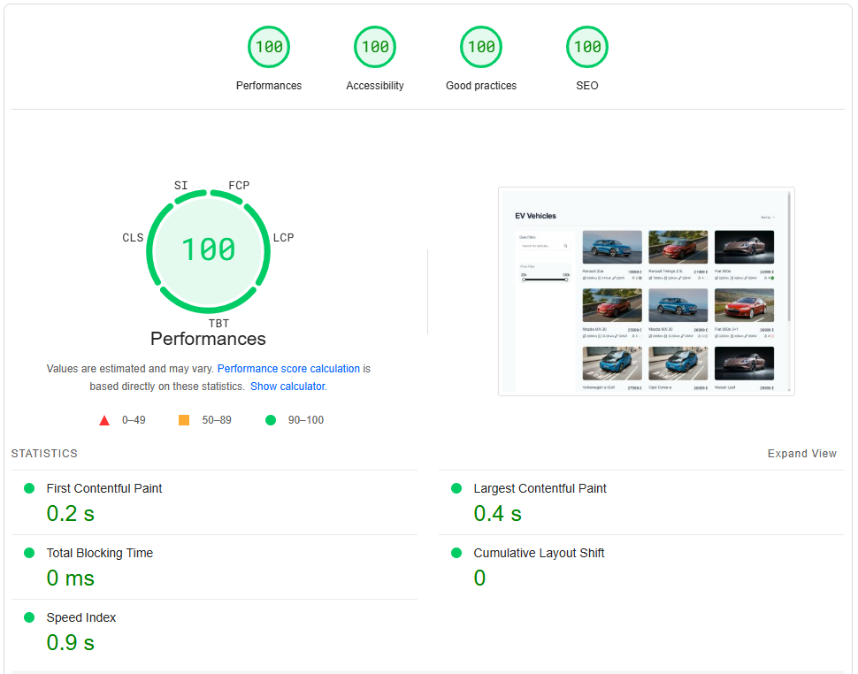

## 🚀 Getting Started



[🔗 View Performance Report : PageSpeed Insights](https://pagespeed.web.dev/analysis/https-vehicle-listing-system-netlify-app-vehicles/31mdwq8ov5?form_factor=desktop)

## 📌 Prerequisites

- [🐳 Docker Desktop](https://www.docker.com/products/docker-desktop/) (required for the dockerized build version)
- **📦 Node.js & npm** (required for development)

## ▶️ Running the Project

### 🐳 Dockerized Build Version

Ensure Docker is installed.

Run the following command to build your project inside Docker:

```bash
npm run docker:build
```

### 💻 Development Mode

Install dependencies:

```bash
npm install
```

Start the development server:

```bash
npm run dev
```

## 🧪 Testing

### ✅ Unit Tests

Run your unit tests with:

```bash
npm run test:unit
```

### 🔍 End-to-End (E2E) Tests

Start the development server:

```bash
npm run dev
```

In a separate terminal, run the E2E tests:

```bash
npm run test:e2e
```
